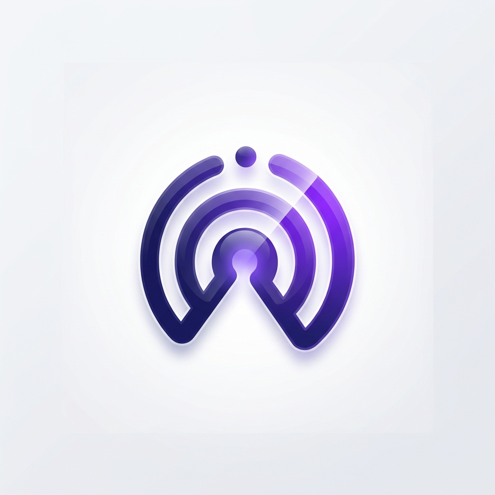

<div align="center">
  
  <h1>Mehery Event Sender Documentation</h1>
  <p><strong>A Premium SDK for Push Notifications, In-App Notifications, Polls, and Real-time Event Tracking.</strong></p>

  [](https://www.npmjs.com/package/react-native-mehery-event-sender)
  [](https://github.com/mehery-soccom/PushApp-React-Native/blob/main/LICENSE)
</div>

---

## 🚀 Overview

The **Mehery Event Sender SDK** provides a comprehensive suite of tools to engage your users through smart notifications and interactive polls. Whether you need to track user behavior, manage deep-linked push notifications, or deploy real-time feedback loops, this SDK is designed for performance and ease of integration.

### **✨ Key Features**
- **🔔 Advanced Push Notifications:** Support for rich media, carousels, and action buttons.
- **📊 Interactive Polls:** Seamlessly mount poll overlays and inline feedback forms.
- **🎯 Precise Event Tracking:** Capture user journeys with login, page open, and custom event markers.
- **👤 User Lifecycle Management:** Effortlessly sync user profiles and session states.
- **⚡ Background Optimization:** Efficient notification handling even when the app is inactive.

---

## 📋 Prerequisites & Checklist

Before you begin, ensure your project has the following configured:

> [!IMPORTANT]
> **Your app will not receive notifications if these steps are skipped.**

- [ ] **Firebase Config Files:**
  - Android: `android/app/google-services.json`
  - iOS: `ios/GoogleService-Info.plist`
- [ ] **Google Services Plugin:** Enabled in `build.gradle`.
- [ ] **Required Dependencies:** Firebase Core, Messaging, and Async Storage.
- [ ] **Permissions:** Notification and Network permissions in Manifest/Plist.
- [ ] **Background Modes:** `remote-notification` enabled on iOS.

---

## 🛠 Installation

Install the SDK and its core dependencies via NPM or Yarn:

```bash
# Install the Mehery SDK
npm install react-native-mehery-event-sender

# Install peer dependencies
npm install @react-native-firebase/app @react-native-firebase/messaging
npm install @react-native-async-storage/async-storage react-native-push-notification
```

**For iOS developers:**
```bash
cd ios && pod install
```

---

## ⚙️ Platform Configuration

### **1. Android Setup**

#### **Gradle Configuration**
Update your project-level `android/build.gradle`:
```gradle
buildscript {
  dependencies {
    // Add the Google Services classpath
    classpath 'com.google.gms:google-services:4.3.15'
  }
}
```

Update your app-level `android/app/build.gradle`:
```gradle
apply plugin: 'com.google.gms.google-services'
```

#### **Manifest Permissions**
Ensure `AndroidManifest.xml` includes these essential permissions:
```xml
<uses-permission android:name="android.permission.INTERNET" />
<uses-permission android:name="android.permission.WAKE_LOCK" />
<uses-permission android:name="android.permission.POST_NOTIFICATIONS" />
```

### **2. iOS Setup**

#### **Capabilities & Info.plist**
Enable **Push Notifications** and **Background Modes** (Remote notifications) in your Xcode project settings. Then, ensure your `Info.plist` contains:

```xml
<key>UIBackgroundModes</key>
<array>
  <string>remote-notification</string>
</array>
```

---

## 📖 Basic Usage

### **🚀 SDK Initialization**
Initialize the SDK as early as possible in your app lifecycle (e.g., in `App.tsx` or `index.js`).

```tsx
import { useEffect } from 'react';
import { initSdk } from 'react-native-mehery-event-sender';

const App = () => {
  useEffect(() => {
    /**
     * @param identifier format: "<tenant>_<channel>"
     * @param debug boolean
     */
    initSdk(null, 'your_tenant_id', false);
  }, []);

  return <MainNavigator />;
};
```

### **🗳 Mounting Polls**
To show interactive polls, mount the `PollOverlayProvider` once at the root of your application.

```tsx
import { PollOverlayProvider } from 'react-native-mehery-event-sender';

export default function App() {
  return (
    <>
      <MainLayout />
      {/* Mount once at root */}
      <PollOverlayProvider />
    </>
  );
}
```

---

## 🔍 Tracking User Events

The SDK provides powerful methods to track user behavior across their entire journey.

### **1. Authentication Events**
Link user actions to their identity or clear state on sign-out.

```tsx
import { OnUserLogin, OnUserLogOut } from 'react-native-mehery-event-sender';

// Call after successful login
await OnUserLogin('unique_user_id_123');

// Call on logout
await OnUserLogOut('unique_user_id_123');
```

### **2. User Profile Enrichment**
Sync user metadata to create targeted notification segments.

```tsx
import { updateUserProfile } from 'react-native-mehery-event-sender';

await updateUserProfile(
  { name: 'Jane Doe', email: 'jane@example.com', city: 'Mumbai' },
  { segment: 'premium', plan: 'enterprise' }
);
```

### **3. Engagement & Navigation**
Track screen views and custom interactions.

```tsx
import { OnPageOpen, sendCustomEvent } from 'react-native-mehery-event-sender';

// Track screen view
OnPageOpen('dashboard_main');

// Track custom business logic
sendCustomEvent('purchase_completed', {
  item_id: 'prod_99',
  value: 49.99,
  currency: 'USD'
});
```

---

## 🎨 UI Components

| Component | Description |
| :--- | :--- |
| **`InlinePollContainer`** | Renders poll cards directly within your scrolling content. |
| **`TooltipPollContainer`** | A wrapper that shows polls as tooltips relative to specific UI elements. |
| **`PollOverlayProvider`** | The global provider for full-screen or popup polls. |

---

## 📦 Example App & Extensions

The `example/ios` project contains reference implementations for advanced iOS features:

| Area | Reference Path |
| :--- | :--- |
| **Notification UI** | `example/ios/ImagePreviewExtension/NotificationViewController.swift` |
| **Service Extension** | `example/ios/ImageServiceExtension/NotificationService.swift` |
| **Live Activities** | `example/ios/DeliveryActivity/` |

---

## 📝 Technical Reference

### **Android Notification Keys**
For images in high-priority notifications:
- **Single:** `image`, `imageUrl`, `image_url`
- **Carousel:** `imageUrls`, `image_urls`, `carousel_images`

### **iOS Action Categories**
Trigger multiple response buttons by sending the `THREE_BUTTON_CATEGORY` key.
- **Actions:** `PUSHAPP_ACTION_1`, `PUSHAPP_ACTION_2`, `PUSHAPP_ACTION_3`

### **ProGuard Rules**
```pro
-keep class com.mehery.pushapp.** { *; }
```

---

## 🆘 Support

Need help? We're here for you.
- 🐛 **Bugs:** [GitHub Issues](https://github.com/mehery-soccom/PushApp-React-Native/issues)
- 💡 **Feedback:** Feel free to reach out via our repository discussion board.

---

<p align="center">Made with ❤️ for the React Native Community</p>
