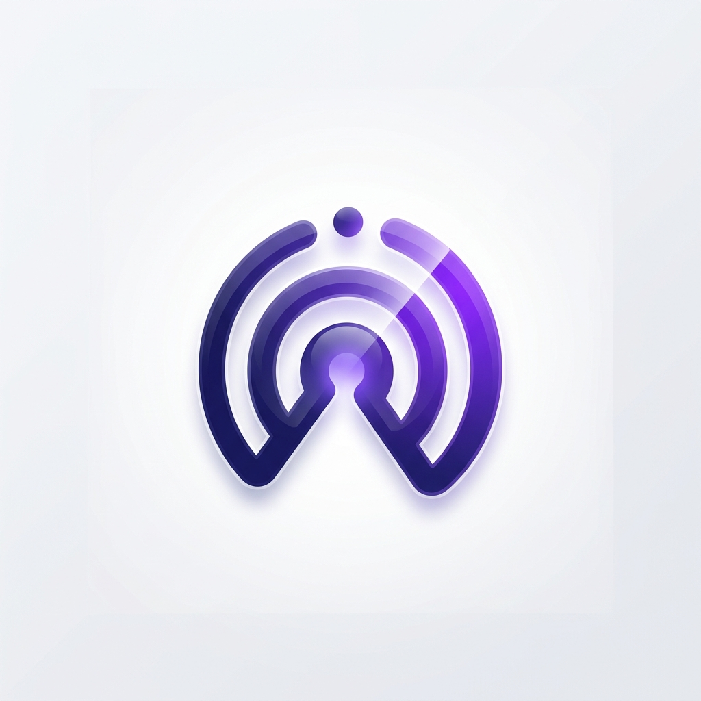

# react-native-mehery-event-sender

[](https://www.npmjs.com/package/react-native-mehery-event-sender)
[](https://github.com/mehery-soccom/PushApp-React-Native/blob/main/LICENSE)

React Native SDK for push notifications, in-app notifications, interactive polls, and real-time event tracking.



## Overview

The Mehery Event Sender SDK helps you engage users with rich push notifications, in-app polls, and precise journey tracking. Use it to register devices, authenticate against PushApp, sync user profiles, and deliver interactive feedback overlays.

### Key features

- Advanced push notifications with rich media, carousels, and action buttons
- Interactive polls via overlay, inline, and tooltip containers
- Event tracking for login, page open, app lifecycle, and custom business events
- User lifecycle management: link/unlink devices and sync profile segments
- Background-optimized notification handling on Android and iOS

## Prerequisites checklist

> **Important:** Your app will not receive notifications correctly if these steps are skipped.

Before integrating, ensure the consumer app has:

- [ ] Firebase config files:
  - Android: `android/app/google-services.json`
  - iOS: `ios/GoogleService-Info.plist`
- [ ] Google Services Gradle plugin enabled (`com.google.gms.google-services`)
- [ ] Peer dependencies: `@react-native-firebase/app`, `@react-native-firebase/messaging`, `@react-native-async-storage/async-storage`, `react-native-push-notification`
- [ ] Notification and network permissions in Manifest / Info.plist
- [ ] iOS Background Modes: `remote-notification`
- [ ] App credentials: prod, sandbox, and development pairs in Info.plist (iOS) and `strings.xml` (Android)
- [ ] On every cold start: `readCredentialsForEnvironment(environment)` → `pushappAuth(xApiId, xApiKey)` **before** `initSdk`
- [ ] `PollOverlayProvider` mounted once at the app root

## Installation

```bash
npm install react-native-mehery-event-sender
npm install @react-native-firebase/app @react-native-firebase/messaging
npm install @react-native-async-storage/async-storage react-native-push-notification
```

For iOS:

```bash
cd ios && pod install
```

## Platform configuration

### Android

#### Gradle

Project-level `android/build.gradle`:

```gradle
buildscript {
  dependencies {
    classpath 'com.google.gms:google-services:4.3.15'
  }
}
```

App-level `android/app/build.gradle`:

```gradle
apply plugin: 'com.google.gms.google-services'
```

#### Manifest permissions

In `AndroidManifest.xml`:

```xml
<uses-permission android:name="android.permission.INTERNET" />
<uses-permission android:name="android.permission.WAKE_LOCK" />
<uses-permission android:name="android.permission.POST_NOTIFICATIONS" />
```

#### One Firebase messaging service (required for background rich push)

React Native Firebase registers `io.invertase.firebase.messaging.ReactNativeFirebaseMessagingService` with a no-op `onMessageReceived`. This SDK provides `com.meheryeventsender.MyFirebaseMessagingService` (a subclass) for BigPicture, custom layouts, and CTA actions.

If **both** services remain in the merged manifest, background delivery can hit the wrong service and **images and action buttons will not show**.

Add `xmlns:tools` on the root `<manifest>` if needed, then inside `<application>` remove the default RNFB service:

```xml
<service
    android:name="io.invertase.firebase.messaging.ReactNativeFirebaseMessagingService"
    android:exported="false"
    tools:node="remove" />
```

#### Native FCM logs (logcat)

The SDK logs FCM handling at **INFO** from `MyFirebaseMessagingService` (not Debug), so default filters that hide `Log.d` still show them.

```text
# Quote '*:S' on zsh (otherwise the shell treats * as a glob and errors).
adb logcat '*:S' 'MyFirebaseMessagingService:I'
```

Simpler (also safe in zsh):

```text
adb logcat -s MyFirebaseMessagingService:I
```

If you see **no** lines tagged `MyFirebaseMessagingService` when a push arrives in the background, `onMessageReceived` did not run. Common causes:

- A top-level FCM `notification` payload while the app is backgrounded (the OS may show a stock tray notification and skip your service)
- Missing `tools:node="remove"` so the wrong `FirebaseMessagingService` handles the message

Use **data-only**, high-priority FCM for Android and confirm the manifest step above. Look for `Mehery FCM: onNewToken` after install or token refresh to confirm this service class is active.

### iOS

#### Capabilities and Info.plist

Enable **Push Notifications** and **Background Modes** (Remote notifications) in Xcode for your app target. Ensure `Info.plist` includes:

```xml
<key>UIBackgroundModes</key>
<array>
  <string>remote-notification</string>
</array>
```

#### App credentials

Store **three** PushApp credential pairs in native config — one per `initSdk` environment. Use the **same** `environment` value for `readCredentialsForEnvironment`, `pushappAuth`, and `initSdk` so API host and auth always match.

| `initSdk` env | Host | iOS keys | Android strings |
| --- | --- | --- | --- |
| `false` | `pushapp.ai` | `MeheryProdAppId` / `MeheryProdAppKey` | `mehery_prod_app_id` / `mehery_prod_app_key` |
| `true` | `pushapp.net.in` | `MeherySandboxAppId` / `MeherySandboxAppKey` | `mehery_sandbox_app_id` / `mehery_sandbox_app_key` |
| `'development'` | `pushapp.co.in` | `MeheryDevAppId` / `MeheryDevAppKey` | `mehery_dev_app_id` / `mehery_dev_app_key` |

Legacy single-key names (`MeheryAppId` / `MeheryAppSecretKey`, `mehery_app_id` / `mehery_app_secret_key`) still work as a **production fallback** only.

**iOS** — add to your app target `Info.plist`:

```xml
<key>MeheryProdAppId</key>
<string>pa_your_prod_app_id</string>
<key>MeheryProdAppKey</key>
<string>pas_your_prod_app_key</string>
<key>MeherySandboxAppId</key>
<string>pa_your_sandbox_app_id</string>
<key>MeherySandboxAppKey</key>
<string>pas_your_sandbox_app_key</string>
<key>MeheryDevAppId</key>
<string>pa_your_dev_app_id</string>
<key>MeheryDevAppKey</key>
<string>pas_your_dev_app_key</string>
```

**Android** — add to `android/app/src/main/res/values/strings.xml`:

```xml
<string name="mehery_prod_app_id" translatable="false">pa_your_prod_app_id</string>
<string name="mehery_prod_app_key" translatable="false">pas_your_prod_app_key</string>
<string name="mehery_sandbox_app_id" translatable="false">pa_your_sandbox_app_id</string>
<string name="mehery_sandbox_app_key" translatable="false">pas_your_sandbox_app_key</string>
<string name="mehery_dev_app_id" translatable="false">pa_your_dev_app_id</string>
<string name="mehery_dev_app_key" translatable="false">pas_your_dev_app_key</string>
```

Rebuild the native app after changing these values.

> **Do not generate new API keys unless you must.** Credentials live in native config (`Info.plist` / `strings.xml`), not a remote config service. A new `pa_` / `pas_` pair from the dashboard requires updating the matching native values and **shipping a new app release** — existing installs keep the old credentials until users update. Prefer keeping your current keys; only rotate when required for security.

> **Match credentials to environment.** If you pass sandbox credentials while `initSdk(..., false)` points at production, requests hit the wrong host with the wrong app identity.

## Authenticate and initialize

### App authentication (`pushappAuth`)

On every cold start **before** `initSdk`, read credentials for your environment and pass them to `pushappAuth`. The SDK compares them with locally stored values and updates storage only when they change. Headers `x-api-id` and `x-api-key` are then included on every API request.

```tsx
import {
  pushappAuth,
  readCredentialsForEnvironment,
  type SdkInitEnvironmentParam,
} from 'react-native-mehery-event-sender';

const environment: SdkInitEnvironmentParam = false; // production
const { xApiId, xApiKey } = await readCredentialsForEnvironment(environment);
await pushappAuth(xApiId, xApiKey);
```

Optional manual override (for testing): `await pushappAuth('pa_your_app_id', 'pas_your_app_key')`.

`pushappAuth()` with no arguments reads **production** credentials only (legacy / single-env apps).

### SDK initialization (`initSdk`)

Initialize as early as possible (for example in `App.tsx` or `index.js`). Always `await` `initSdk` so device registration and WebSocket connect finish before you rely on SDK state.

| Param | Type | Default | Description |
| --- | --- | --- | --- |
| `context` | `any` | — | Reserved; pass `null` |
| `identifier` | `string` | — | Channel ID, format `"<tenant>_<channel>"` |
| `environment` | `boolean \| 'development'` | `true` | Host: `false` = `pushapp.ai`, `true` = `pushapp.net.in`, `'development'` = `pushapp.co.in` |
| `logs` | `boolean` | `true` | Enable or disable SDK console logging |

```tsx
import { useEffect } from 'react';
import {
  pushappAuth,
  initSdk,
  readCredentialsForEnvironment,
  type SdkInitEnvironmentParam,
} from 'react-native-mehery-event-sender';

const App = () => {
  useEffect(() => {
    const bootstrap = async () => {
      const environment: SdkInitEnvironmentParam = false;
      const { xApiId, xApiKey } =
        await readCredentialsForEnvironment(environment);
      await pushappAuth(xApiId, xApiKey);
      // identifier format: "<tenant>_<channel>"
      await initSdk(null, 'your_tenant_your_channel_id', environment, false);
      // await initSdk(null, 'your_tenant_your_channel_id', true);           // sandbox
      // await initSdk(null, 'your_tenant_your_channel_id', 'development'); // development
    };
    bootstrap();
  }, []);

  return <MainNavigator />;
};
```

Environment host mapping:

- `false` — production: `pushapp.ai`
- `true` — sandbox: `pushapp.net.in` (default)
- `'development'` — development: `pushapp.co.in`

Logging (`logs` fourth argument):

- `true` — SDK debug output is printed to the JS console (default)
- `false` — all SDK-owned `console.log` / `warn` / `error` calls are suppressed

Native Android FCM logcat lines are unaffected (native code).

### Optional startup helpers

Set geo context before init (used by register and event payloads):

```tsx
import { setGeoIP } from 'react-native-mehery-event-sender';

setGeoIP({
  ip: '203.0.113.1',
  location: { lat: 19.076, lng: 72.8777 },
  country: { iso_code: 'IN', name: 'India' },
});
```

Wait for init to complete before login if needed:

```tsx
import { waitForSdkReady, OnUserLogin } from 'react-native-mehery-event-sender';

await waitForSdkReady();
await OnUserLogin('user_123');
```

Register the FCM background handler early in `index.js` when you need JS background message handling:

```tsx
import { registerFcmBackgroundHandler } from 'react-native-mehery-event-sender';

registerFcmBackgroundHandler();
```

On Android 13+, request notification permission when appropriate:

```tsx
import { ensureAndroidNotificationPermission } from 'react-native-mehery-event-sender';

await ensureAndroidNotificationPermission();
```

## Mount polls

Mount `PollOverlayProvider` once at the root of your application for full-screen / popup polls.

```tsx
import { PollOverlayProvider } from 'react-native-mehery-event-sender';

export default function App() {
  return (
    <>
      <MainLayout />
      <PollOverlayProvider />
    </>
  );
}
```

Optional in-app poll placeholders:

```tsx
import {
  InlinePollContainer,
  TooltipPollContainer,
} from 'react-native-mehery-event-sender';
```

| Component | Description |
| --- | --- |
| `PollOverlayProvider` | Global provider for full-screen or popup polls |
| `InlinePollContainer` | Renders poll cards inside scrolling content |
| `TooltipPollContainer` | Shows polls as tooltips relative to specific UI elements |

## Track user events

### Authentication events

```tsx
import { OnUserLogin, OnUserLogOut } from 'react-native-mehery-event-sender';

// After successful sign-in or sign-up — map this device/session to your user ID
await OnUserLogin('unique_user_id_123');

// Before or after clearing local auth state on sign-out
await OnUserLogOut('unique_user_id_123');
```

### User profile enrichment

Sync user metadata for targeted segments. The SDK keeps the last successfully pushed profile locally and only calls `PUT /v1/customer/profile` when `additionalInfo` or `cohorts` change. The snapshot is cleared on logout.

```tsx
import { updateUserProfile } from 'react-native-mehery-event-sender';

await updateUserProfile(
  { name: 'Jane Doe', email: 'jane@example.com', city: 'Mumbai' },
  { segment: 'premium', plan: 'enterprise' }
);
```

### Engagement and navigation

```tsx
import {
  OnPageOpen,
  OnPageClose,
  OnAppOpen,
  OnAppLaunch,
  sendCustomEvent,
} from 'react-native-mehery-event-sender';

// Prefer: await OnUserLogin(...) first, then track screens.
// Interactive events fired during the /device/link window are queued in memory
// and flushed automatically after a successful login (or after login failure
// clears the stuck pre-link user_id so guest identity can send).
const cancelPageOpen = OnPageOpen('dashboard_main');
// On unmount / blur, cancel the delayed send if the screen left early:
// cancelPageOpen();

// When leaving a page
OnPageClose('dashboard_main');

// App lifecycle helpers
OnAppOpen();
await OnAppLaunch();

// Custom business events — any keys your analytics needs
sendCustomEvent('purchase_completed', {
  item_id: 'prod_99',
  value: 49.99,
  currency: 'USD',
  campaign_id: 'spring_launch_2026',
});
```

## Public API reference

| API | Description |
| --- | --- |
| `pushappAuth(appId?, appSecretKey?)` | Persist credentials locally; inject `x-api-id` / `x-api-key` on every API call |
| `readCredentialsForEnvironment(environment)` | Read prod / sandbox / dev credentials from native config for the given `initSdk` environment |
| `readNativeAppCredentials()` | Read production credentials only (legacy / single-env) |
| `initSdk(context, identifier, environment?, logs?)` | Initialize SDK; `identifier` format `"<tenant>_<channel>"` |
| `waitForSdkReady()` | Resolves when `initSdk` has finished |
| `setGeoIP(geo)` | Set geo context for register / events |
| `OnUserLogin(userId)` / `OnUserLogOut(userId)` | Link or delink device to host user |
| `OnPageOpen(name)` / `OnPageClose(name?)` | Screen lifecycle events (`OnPageOpen` returns a cancel fn; interactive events during pre-link are queued and flushed after login) |
| `OnAppOpen()` / `OnAppLaunch()` | App lifecycle events |
| `sendCustomEvent(name, data?, options?)` | Custom business events |
| `flushPendingCustomEvents()` | Drain interactive events queued while register/link was unavailable |
| `updateUserProfile(additionalInfo, cohorts?, options?)` | Sync profile to PushApp |
| `updatePushToken(token)` | Refresh FCM / APNs token with backend |
| `setDeviceMetadata(headers)` | Merge extra string headers into every request |
| `getDeviceId()` | Persistent SDK device UUID |
| `PollOverlayProvider`, `showPollOverlay`, `hidePollOverlay` | Poll overlay UI |
| `InlinePollContainer`, `TooltipPollContainer` | Inline / tooltip poll placeholders |
| `registerFcmBackgroundHandler()` | Register background FCM handler early in `index.js` |
| `ensureAndroidNotificationPermission()` | Request `POST_NOTIFICATIONS` on Android 13+ |
| `setNotificationUrlHandler`, `configureNotificationLinkRewrites`, `openNotificationLink` | Notification deep-link helpers |
| `triggerCarouselNotification`, `triggerLiveActivity` | Local test helpers for rich push / Live Activity |

**Exported types:** `SdkInitEnvironmentParam`, `GeoIpInput`, `GeoIpPayload`, `OnUserLoginResult`, `SendCustomEventOptions`, `UpdateUserProfileOptions`, `UpdateUserProfileResult`, `TriggerCarouselNotificationParams`, `NotificationLinkRewrite`, `FcmBackgroundMessageListener`.

## Example app and iOS extensions

The `example/ios` project ships native targets you can adapt for rich notifications and Live Activities. Copy or adapt the Swift, plists, and assets into your own app; branding and UI design are yours — these paths only show where the hooks and data live.

| Area | Path |
| --- | --- |
| Rich notification UI (content extension) | `example/ios/ImagePreviewExtension/NotificationViewController.swift` (and `MainInterface.storyboard`, `Assets.xcassets` in the same folder) |
| Modify notification content before display (service extension) | `example/ios/ImageServiceExtension/NotificationService.swift` |
| Live Activity / delivery-style widget | `example/ios/DeliveryActivity/` (Swift sources, `Info.plist`, `Assets.xcassets`) |

Mirror the same targets and capabilities in Xcode if you are not using the example workspace directly.

## Notification payload notes

### Android: FCM data-only for rich background notifications

**Foreground** and **background** use different code paths.

- **Foreground:** JavaScript (`messaging().onMessage`) can show a local notification with big-picture image and CTA actions from the payload.
- **Background / not running:** Only the native `MyFirebaseMessagingService` can add BigPicture, custom layouts, and `NotificationCompat` actions.

On Android, Firebase will **not** call `onMessageReceived` for messages that use a top-level FCM **`notification`** block while the app is in the background. The system shows a default tray notification instead, without this SDK’s custom images or action buttons.

To get rich background notifications:

1. Send **data-only** FCM messages: put title, body, image URL, and CTA fields as **string** values in the FCM `data` map.
2. Set **high priority** for the Android message (FCM HTTP v1: e.g. `android.priority: HIGH`) so delivery is not deferred too long under Doze.
3. If iOS still needs a `notification` or APNs block, use **per-platform** FCM overrides (data-only for Android; `notification` + APNs for iOS).

Do not rely on `setBackgroundMessageHandler` alone to draw rich Android notifications; it cannot make `onMessageReceived` run when the system does not deliver the message to your service.

**How to verify:** With the app backgrounded, send a data-only test push, then:

```text
adb logcat -s MyFirebaseMessagingService:I
```

You should see `Mehery FCM: onMessageReceived` and `FCM[raw]` / `FCM[merged]` lines. With a `notification` block, the service often will **not** log in background, and the tray shows a basic system notification. That contrast explains “works in foreground, not in background.”

### Android image keys

- Single image: `image`, `imageUrl`, `image_url`
- Carousel: `imageUrls`, `image_urls`, `carousel_images`, or `image1`, `image2`, …

### Body tap opens a link (`notification_url`)

When the push payload includes `notification_url` (or `notificationUrl`), tapping the **notification body** (title/message area) opens that URL in the system browser. CTA action buttons still use their own URLs (`cta_buttons` / `url1`–`url3` on Android; `buttons` array / action IDs on iOS). Without `notification_url`, body tap only launches the app.

The SDK resolves the body URL from the root payload and from Mehery template nests: `style.notification_url`, stringified `style`, `templateData`, and `template.style` / `template.data` (same shape as the template API `style` object).

| Platform | Payload field | Body tap handler |
| --- | --- | --- |
| Android | FCM `data.notification_url` (or nested `style` / `templateData`) | Native `NotificationCtaUrlActivity` + foreground JS `Linking.openURL` |
| iOS | APNs / FCM `data` (root or nested `style` / `templateData`) | Example [`AppDelegate.swift`](example/ios/MeheryEventSenderExample/AppDelegate.swift) `urlForNotificationBody` + JS `Linking.openURL` fallback |

> **Push server requirement:** `/send-notification` must include `notification_url` on the device payload (flattened in FCM `data` is best). If it only exists in the template `style` object, the send step must still forward that object (or flatten it) so iOS/Android can read it on tap. Mapping only `buttons` → `url1` / `title1` / `action1` is not enough.

**iOS Live Activity:** The example app only starts a Live Activity when `activity_id` is set **and** the payload looks like a live template (`message1`–`message3`, `progressPercent`, `live_activity=true`, or a hero image URL). Simple templates with only `activity_id` no longer show an empty Live Activity before the banner.

Example payload after correct server mapping:

```json
{
  "title": "Hello",
  "body": "World",
  "notification_url": "https://example.com/article",
  "url1": "https://mehery.com",
  "title1": "Yes",
  "action1": "PUSHAPP_YES"
}
```

**iOS host apps:** The npm package does not ship `AppDelegate`. Merge `urlForNotificationBody` and the default-action URL open from the example app into your target’s `AppDelegate` (see [Example app and iOS extensions](#example-app-and-ios-extensions)).

**Silent keep-alive (no blank banner):** The server may send a data-only push with `type` / `data.type` = `silent_keepalive` (no title/body). The SDK replies with `POST /pushapp/silent/ping` and must **not** show a notification. Host `AppDelegate` must treat that type as silent:

1. Forward the payload to JS (`PushNotificationEvent` / `PushTokenManager.sendNotificationEventOrQueue`).
2. In `userNotificationCenter(_:willPresent:…)`, call `completionHandler([])` (no banner).
3. In `application(_:didReceiveRemoteNotification:fetchCompletionHandler:)`, do **not** schedule a local notification; call `completionHandler(.newData)` and return.

Copy the pattern from the example [`AppDelegate.swift`](example/ios/MeheryEventSenderExample/AppDelegate.swift) (`isSilentNoUiPush`). Skipping this step can show an empty/blank banner even though the JS pong succeeds.

### iOS action categories

To show three action buttons, send category `THREE_BUTTON_CATEGORY` in the APNs payload. Action IDs received in JS / native tap handling:

- `PUSHAPP_ACTION_1`
- `PUSHAPP_ACTION_2`
- `PUSHAPP_ACTION_3`

## ProGuard

```pro
-keep class com.mehery.pushapp.** { *; }
```

## Support

Raise bugs or feature requests in [GitHub Issues](https://github.com/mehery-soccom/PushApp-React-Native/issues).
